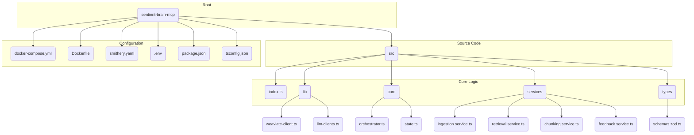

Understood. Here is a direct, technical action plan for your AI agent engineer. This plan is designed for a local-first, Docker-based deployment that integrates with Smithery, Weaviate, and IDEs like Cursor and Windsurf. It uses the exact model versions you specified and omits user stories in favor of direct, actionable tasks with clear verification steps.

-----

### **Executive Action Plan: Sentient Brain MCP Server**

This document provides the technical implementation plan and task breakdown for building the Sentient Brain MCP Server. The architecture is centered on Weaviate and designed for local Docker-based development and testing, with a clear path to production deployment on Smithery.

#### **Codebase Structure**

The project will be organized as a TypeScript monorepo. The following graph illustrates the target directory structure:

-----

### **Phase 1: Foundational Environment & Local Services Setup**

**Objective:** Establish a fully containerized local development environment where the MCP Server and Weaviate can communicate. This phase is complete when the engineer can run `smithery dev` and connect to a running, empty server.

  * **Task 1.1: Configure Docker Compose for Local Services**

      * **Action:** Create a `docker-compose.yml` file at the project root.
      * **Instruction:**
        1.  Define a service for `weaviate`. Use the official `semitechnologies/weaviate` image. Configure it with a text vectorization module (e.g., `text2vec-transformers`).
        2.  Define a service for the `mcp-server`. This service will be built from the project's `Dockerfile`.
        3.  Configure the `mcp-server` to `depends_on: [weaviate]` to ensure correct startup order.
        4.  Establish a shared Docker network to allow the MCP server to resolve Weaviate at `http://weaviate:8080`.
        5.  Use an `.env` file to manage secrets (`GEMINI_API_KEY`, `GROQ_API_KEY`) and pass them into the `mcp-server` container.

  * **Task 1.2: Containerize the TypeScript MCP Server**

      * **Action:** Create a `Dockerfile` in the project root.
      * **Instruction:**
        1.  Use a multi-stage build. The `build` stage installs all dependencies from `package.json` and compiles the TypeScript source from `/src` into JavaScript in a `/dist` directory.
        2.  The final stage must be a lean Node.js image (e.g., `node:20-slim`). Copy only the production `node_modules` and the compiled `/dist` folder from the `build` stage.
        3.  Set the `CMD` to execute the compiled entry point: `node dist/index.js`.

  * **Task 1.3: Configure Smithery for Local Docker Development**

      * **Action:** Create and configure the `smithery.yaml` file.
      * **Instruction:**
        1.  Set `runtime: typescript`.
        2.  Define the `startCommand` to use `docker-compose up --build`. This ensures `smithery dev` manages the entire containerized environment.
        3.  Reference the exported `configSchema` from `src/index.ts` to allow Smithery to manage API key injection.

  * **Task 1.4: Define and Initialize Weaviate Schema**

      * **Action:** Create a script at `src/database/init-schema.ts` to programmatically define the Weaviate collections. This script replaces the previous Prisma migration setup.[1, 1, 1, 1, 1, 1, 1, 1, 1]
      * **Instruction:**
        1.  Use the `weaviate-ts-client` to connect to the Weaviate instance.
        2.  Define the schemas for `Project`, `Document`, and `Chunk` collections.
        3.  For the `Chunk` collection, define `fromDocument` and `relatesTo` properties as **cross-references** to enable graph functionality.
        4.  The script must be idempotent, checking if a collection exists before attempting creation.
        5.  Remove all Prisma-related files and dependencies (`prisma` directory, `@prisma/client` from `package.json`).[1, 1, 1, 1, 1]

  * **Checkpoint 1: Human-in-the-Loop Verification**

      * **Action:** Run `npx @smithery/cli dev`.
      * **Verification:**
        1.  Confirm both Weaviate and MCP Server containers start without errors.
        2.  Access the Smithery Playground in the browser. The server should be connected but have no tools.
        3.  Connect to the local Weaviate instance (e.g., via its console or API) and verify that the `Project`, `Document`, and `Chunk` collections have been created correctly.

-----

### **Phase 2: Knowledge Ingestion Pipeline**

**Objective:** Implement the agentic workflow that autonomously discovers, processes, and indexes documents and code into Weaviate.

  * **Task 2.1: Implement Resilient Web Scraping Service**

      * **Action:** Create `src/services/scraping.service.ts`.
      * **Instruction:**
        1.  Use **Playwright** to handle dynamic, JavaScript-heavy websites.[2, 3, 4]
        2.  Implement ethical scraping best practices: respect `robots.txt`, set a descriptive `User-Agent`, and implement rate limiting.[5, 6]
        3.  Wrap all network requests in resilience patterns: **Retry** with exponential backoff for transient errors and a **Circuit Breaker** for persistent failures.[7]

  * **Task 2.2: Implement Advanced Chunking Service**

      * **Action:** Create `src/services/chunking.service.ts`.
      * **Instruction:**
        1.  **For Documentation:** Implement a multi-stage chunker using LangChain's `HTMLHeaderTextSplitter` followed by `RecursiveCharacterTextSplitter`.[8, 9, 10] This preserves semantic structure.
        2.  **For Source Code:** Implement a syntax-aware chunker using a library that can generate an **Abstract Syntax Tree (AST)** for TypeScript. Create chunks based on functions, classes, and interfaces to maintain structural integrity.

  * **Task 2.3: Implement LLM-Powered Enrichment and Graph Construction**

      * **Action:** Create `src/services/enrichment.service.ts`.
      * **Instruction:**
        1.  Use the **`gemini-2.5-flash-lite-preview-06-17`** model.
        2.  Create a function that takes a text chunk and prompts Gemini to extract key entities (e.g., function names, libraries) and their relationships (`CALLS`, `IMPLEMENTS`).
        3.  Create a function to batch-add processed `Chunk` objects to Weaviate.
        4.  Create a function to perform a second pass that adds the `relatesTo` **cross-references** between the newly created `Chunk` objects, using the relationships extracted by Gemini.

  * **Checkpoint 2: Human-in-the-Loop Verification**

      * **Action:** Create a temporary test script (`test-ingestion.ts`) that uses the new services to ingest a single, complex documentation page (e.g., a page from the LangChain JS docs).
      * **Verification:**
        1.  Execute the script and monitor server logs for successful completion.
        2.  Using the Weaviate console, inspect the created `Document` and `Chunk` objects.
        3.  Verify that `Chunk` objects contain vectorized data.
        4.  Verify that `relatesTo` cross-references exist between related `Chunk` objects, confirming the graph structure is being built.

-----

### **Phase 3: Retrieval & Feedback Pipeline**

**Objective:** Implement the agentic workflow that understands user queries, retrieves contextually rich information from Weaviate, and learns from feedback.

  * **Task 3.1: Implement Hybrid Search and Graph Traversal Service**

      * **Action:** Create `src/services/retrieval.service.ts`.
      * **Instruction:**
        1.  Implement an `intent_recognition` function using the **Groq API with `meta-llama/llama-4-scout-17b-16e-instruct`** for low-latency query classification.
        2.  Implement a `hybrid_search` function that executes a Weaviate hybrid query (vector + BM25), tuning the `alpha` parameter based on the recognized intent.
        3.  Implement a `context_expansion` function that takes the results from the hybrid search and uses Weaviate's **GraphQL API** to traverse the `fromDocument` and `relatesTo` cross-references, fetching a connected subgraph of information.

  * **Task 3.2: Implement Synthesis and Orchestration**

      * **Action:** Create `src/core/orchestrator.ts`.
      * **Instruction:**
        1.  Use **LangGraph** to design a state machine for the retrieval pipeline with nodes for `recognize_intent`, `hybrid_search`, `expand_context`, and `synthesize_answer`.
        2.  The `synthesize_answer` node must pass the final, enriched context to **`gemini-2.5-flash-lite-preview-06-17`** to generate the user-facing response.
        3.  Implement the feedback loop logic: create a `process_feedback` tool that triggers a targeted re-ingestion workflow within the LangGraph orchestrator.

  * **Checkpoint 3: Human-in-the-Loop Verification**

      * **Action:** Expose a basic `query_knowledge_base` tool in `src/index.ts` that triggers the retrieval pipeline.
      * **Verification:**
        1.  Run `smithery dev`.
        2.  In the Smithery playground, call the `query_knowledge_base` tool with a question related to the document ingested in Checkpoint 2.
        3.  Monitor server logs to trace the execution through the LangGraph nodes.
        4.  Validate that the final synthesized response is accurate and contextually relevant.

-----

### **Phase 4: Full IDE Integration & Final Testing**

**Objective:** Make the fully-featured, locally running MCP server accessible and usable from within Cursor and Windsurf.

  * **Task 4.1: Implement All Public-Facing MCP Tools**

      * **Action:** Finalize the tool definitions in `src/index.ts`.
      * **Instruction:**
        1.  Implement the full suite of tools: `ingest_web_document`, `query_knowledge_base`, and `process_feedback`.
        2.  Ensure each tool uses Zod for input validation and acts as a clean entry point to its corresponding LangGraph pipeline.

  * **Task 4.2: Create IDE Integration Documentation**

      * **Action:** Create a `README.md` file with clear, copy-pasteable instructions for IDE integration.
      * **Instruction:**
        1.  Provide the exact JSON configuration for Cursor's `.cursor/mcp.json` file. The `command` must be `docker-compose` with `args: ["up", "--build"]` to ensure the environment is always current.
        2.  Provide the equivalent configuration for Windsurf's `mcp_config.json`.
        3.  Document how to pass API keys from the IDE's environment settings into the Docker container via the `env` block in the respective JSON configurations.

  * **Checkpoint 4: End-to-End Human-in-the-Loop Test**

      * **Action:** Configure a local Cursor or Windsurf IDE to connect to the MCP server using the instructions from Task 4.2.
      * **Verification:**
        1.  **Test Ingestion:** In the IDE chat, provide a prompt containing a new documentation URL (e.g., "Help me with this: [https://weaviate.io/developers/weaviate/api/graphql](https://weaviate.io/developers/weaviate/api/graphql)"). Verify that the server logs show the ingestion pipeline being triggered.
        2.  **Test Retrieval:** After ingestion completes, ask a question related to the new content (e.g., "@sentient-brain what are the limitations of Weaviate's GraphQL API?"). Validate the accuracy of the synthesized response.
        3.  **Test Feedback:** If the response is slightly off, provide corrective feedback in a follow-up prompt (e.g., "@sentient-brain that was helpful, but you missed the part about int64. Please re-check the source and try again."). Verify that the feedback loop triggers a targeted re-ingestion and provides an improved answer.