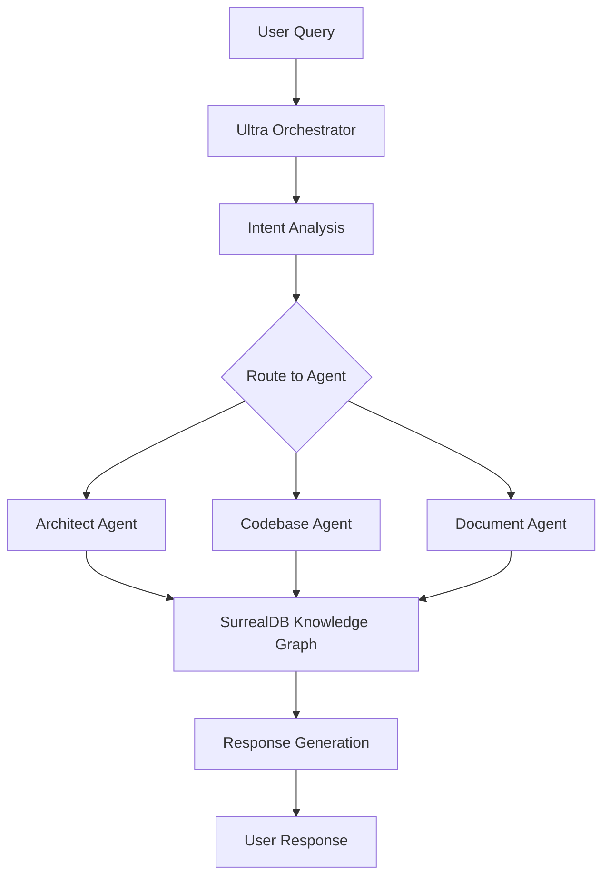

# Sentient Brain Multi-Agent System - Smithery.ai Deployment Guide

## 🚀 Quick Start for Smithery.ai

This guide covers deploying the Sentient Brain Multi-Agent System to [Smithery.ai](https://smithery.ai), a platform for deploying and managing MCP (Model Context Protocol) servers.

## 📋 Prerequisites

- Docker installed locally
- Git repository with the project
- Required API keys:
  - Groq API key for LLM inference
  - Google GenAI API key (optional)
  - SurrealDB connection details

## 🔧 Deployment Files

The following files are configured for Smithery.ai deployment:

### 1. `smithery.yaml` - Runtime Configuration
```yaml
version: 1
start:
  command: ["python", "-m", "uvicorn", "src.main:app", "--host", "0.0.0.0", "--port", "8000"]
  port: 8000

configSchema:
  type: object
  required:
    - GROQ_API_KEY
    - SURREAL_URL
    - SURREAL_USER
    - SURREAL_PASS
  properties:
    GROQ_API_KEY:
      type: string
      description: "Groq API key for LLM inference"
    # ... additional configuration
```

### 2. `smithery.json` - Metadata
```json
{
  "id": "sentient-brain/multi-agent-system",
  "name": "Sentient Brain Multi-Agent System",
  "description": "Advanced AI Code Developer system...",
  "version": "1.0.0",
  "capabilities": [
    "Intent disambiguation and workflow orchestration",
    "Code analysis and understanding",
    "Architecture design and recommendations"
  ]
}
```

### 3. `Dockerfile` - Container Configuration
Optimized multi-stage build for Smithery.ai with:
- Security best practices (non-root user)
- Health checks
- Proper port exposure
- Minimal image size

## 🧪 Testing & Validation

### 1. Run Comprehensive Tests
```bash
# Run all tests
python test_runner.py

# Run specific test categories
python -m pytest tests/ -v
```

### 2. Validate Deployment Readiness
```bash
# Check deployment configuration
python deploy_smithery.py

# Test Docker build locally
docker build -t sentient-brain-test .
docker run -p 8000:8000 sentient-brain-test
```

### 3. Admin UI Testing
```bash
# Start admin interface
streamlit run admin_ui.py

# Access at http://localhost:8501
```

## 🏗️ Architecture Overview



## 🎛️ Admin Dashboard Features

The corporate-level admin UI provides:

### 📊 Dashboard
- Real-time system metrics
- Agent activity monitoring
- Performance analytics
- Success rate tracking

### 🤖 Agent Monitor
- Individual agent status
- Task completion tracking
- Performance scoring
- Workflow visualization

### 🧪 Test Suite
- **Unit Tests**: Core component validation
- **Integration Tests**: End-to-end workflows
- **Behavior Tests**: Agent-specific functionality
- **Performance Tests**: Load and stress testing

### 📊 Data Explorer
- Knowledge graph visualization
- Agent message logs
- Workflow state inspection
- Performance metrics analysis

### 📈 Analytics
- Usage patterns
- Performance trends
- Error analysis
- Success metrics

## 🔐 Security & Configuration

### Environment Variables
Required for deployment:

```bash
# Core LLM Service
GROQ_API_KEY=your_groq_api_key

# Database Configuration
SURREAL_URL=ws://localhost:8000/rpc
SURREAL_USER=root
SURREAL_PASS=your_secure_password
SURREAL_NAMESPACE=sentient_brain
SURREAL_DATABASE=multi_agent

# Optional: Enhanced AI Capabilities
GOOGLE_API_KEY=your_google_api_key

# System Configuration
LOG_LEVEL=INFO
```

### Security Features
- Non-root container execution
- Input validation and sanitization
- API rate limiting
- Secure secret management
- Audit logging

## 🚀 Deployment Steps

### 1. Prepare Repository
```bash
# Ensure all files are present
ls -la Dockerfile smithery.yaml smithery.json requirements.txt

# Validate configuration
python deploy_smithery.py
```

### 2. Deploy to Smithery.ai

1. **Connect Repository**:
   - Go to [Smithery.ai](https://smithery.ai)
   - Click "Deploy Server"
   - Connect your GitHub repository

2. **Configure Environment**:
   - Add required API keys
   - Set database connection details
   - Configure optional parameters

3. **Deploy**:
   - Smithery will automatically build and deploy
   - Monitor deployment progress
   - Test endpoints once deployed

### 3. Verify Deployment
```bash
# Test deployed endpoints
curl https://your-deployment-url.smithery.ai/api/v1/health

# Test MCP functionality
curl -X POST https://your-deployment-url.smithery.ai/api/v1/query \
  -H "Content-Type: application/json" \
  -d '{"query": "Help me build a REST API"}'
```

## 📈 Performance Optimization

### Recommended Configuration
- **Memory**: 2GB minimum, 4GB recommended
- **CPU**: 1 core minimum, 2 cores recommended
- **Storage**: 10GB for knowledge graph data
- **Concurrent Users**: Up to 50 simultaneous

### Scaling Considerations
- Horizontal scaling via multiple instances
- Database connection pooling
- Caching for frequent queries
- Load balancing for high availability

## 🔧 Troubleshooting

### Common Issues

1. **Build Failures**
   ```bash
   # Check Dockerfile syntax
   docker build --no-cache -t test .
   
   # Validate requirements
   pip install -r requirements.txt
   ```

2. **Runtime Errors**
   ```bash
   # Check logs
   docker logs container_name
   
   # Validate environment
   python -c "import os; print(os.environ.get('GROQ_API_KEY', 'Not set'))"
   ```

3. **API Connectivity**
   ```bash
   # Test health endpoint
   curl -f http://localhost:8000/api/v1/health
   
   # Check database connection
   python -c "from src.services.surreal_service import SurrealDBService; print('DB OK')"
   ```

### Debug Mode
Enable detailed logging:
```bash
export LOG_LEVEL=DEBUG
python -m uvicorn src.main:app --reload --log-level debug
```

## 📊 Monitoring & Analytics

### Health Checks
- **Endpoint**: `/api/v1/health`
- **Frequency**: Every 30 seconds
- **Timeout**: 10 seconds
- **Retries**: 3 attempts

### Metrics Collection
- Response times
- Success rates
- Agent performance
- Resource utilization
- Error patterns

### Alerting
Configure alerts for:
- High error rates (>5%)
- Slow response times (>2s)
- Agent failures
- Resource exhaustion

## 🛠️ Development & Testing

### Local Development
```bash
# Install dependencies
pip install -r requirements.txt

# Start SurrealDB
docker run -p 8000:8000 surrealdb/surrealdb:latest start memory

# Start application
python -m uvicorn src.main:app --reload

# Start admin UI
streamlit run admin_ui.py --server.port 8501
```

### Testing Framework
```bash
# Run comprehensive test suite
python test_runner.py

# Specific test categories
python -m pytest tests/unit/ -v
python -m pytest tests/integration/ -v
python -m pytest tests/performance/ -v
```

## 📚 Additional Resources

- [Smithery.ai Documentation](https://smithery.ai/docs)
- [MCP Protocol Specification](https://spec.modelcontextprotocol.io/)
- [SurrealDB Documentation](https://surrealdb.com/docs)
- [FastAPI Documentation](https://fastapi.tiangolo.com/)

## 🤝 Support & Contributing

- **Issues**: Report bugs and feature requests
- **Documentation**: Contribute to guides and examples
- **Code**: Submit pull requests for improvements
- **Community**: Join discussions and share experiences

---

## 🎯 Quick Deployment Checklist

- [ ] All required files present (`Dockerfile`, `smithery.yaml`, `smithery.json`)
- [ ] Dependencies properly specified in `requirements.txt`
- [ ] Environment variables documented
- [ ] Docker build successful locally
- [ ] Health checks passing
- [ ] API endpoints responsive
- [ ] Admin UI functional
- [ ] Tests passing (>90% success rate)
- [ ] Security configurations verified
- [ ] Performance requirements met

**Ready for production deployment!** 🚀